# kb1179_1125170031_uts

**Ujian Tengah Semester Flutter — UI + Deploy + Git**

## Getting Started
**tahapan yang telah di lakukan**

1. Membuat app bar di main.dart dengan title: "KB1170_1125170031_UTS_",

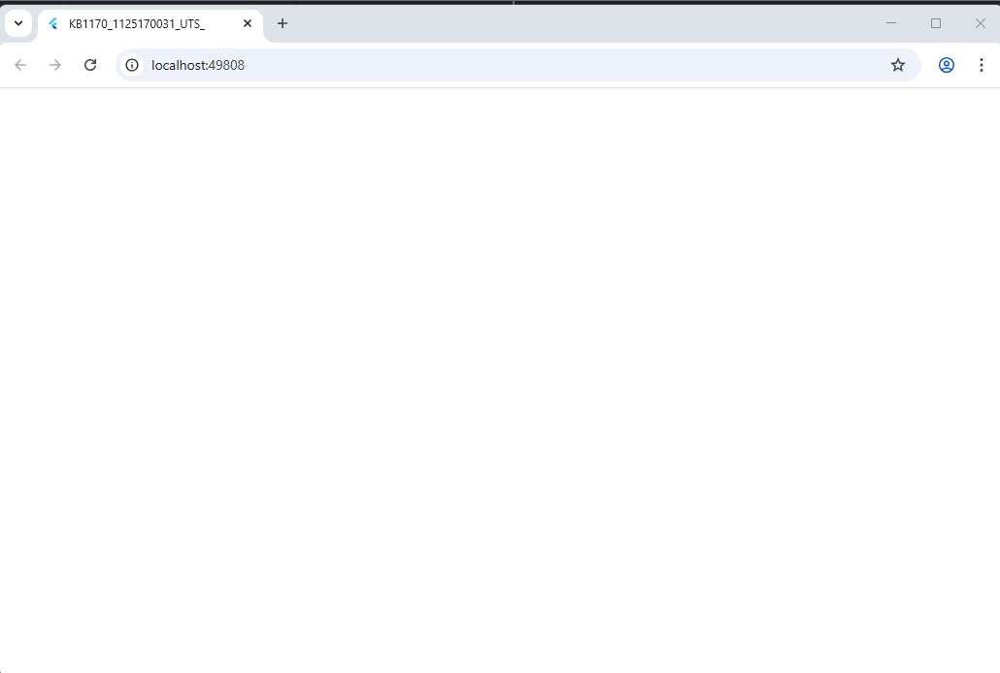

2. membuat splash_screen_1.dart dengan tampilan emage bulat dengan posisi berada di pojok kiri atas layar

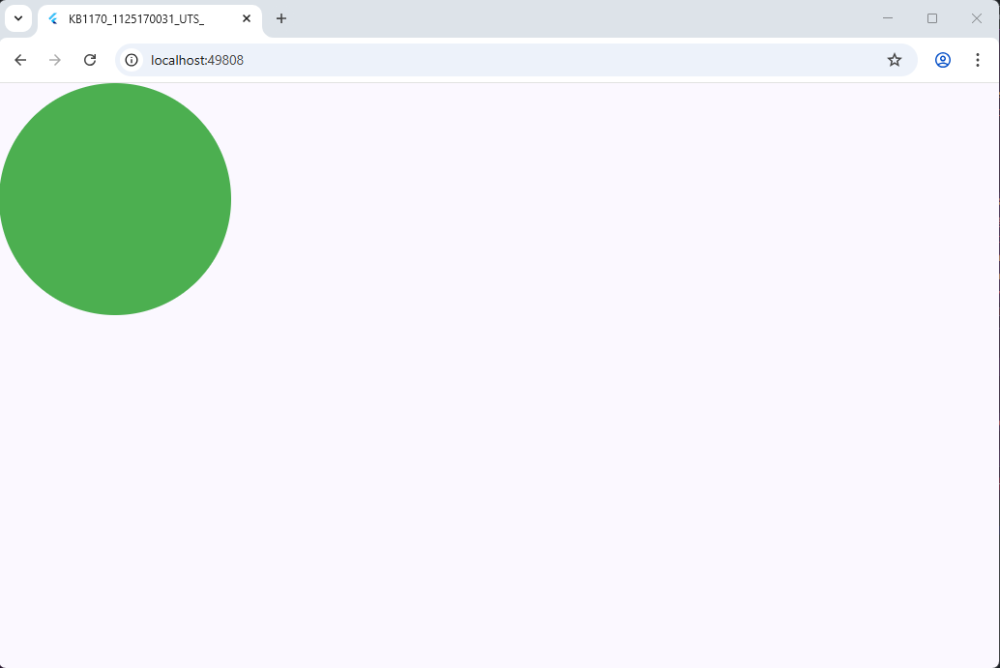

3. Merubah posisi image di bagian tepat pada tengah layar

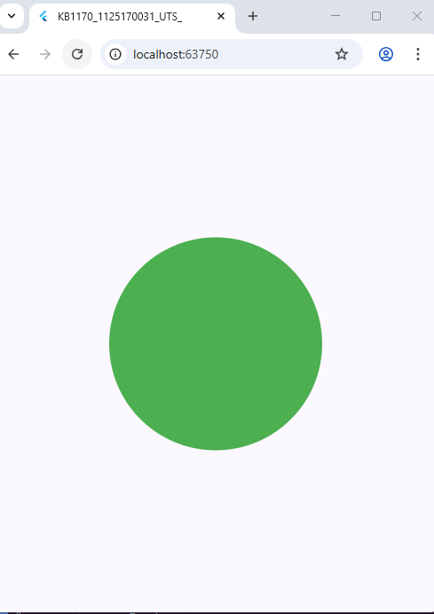

4. Menambahkan Logo (gambar) pada BoxDecoration

5. Menambkahan tulisan welcome dibawah gambar

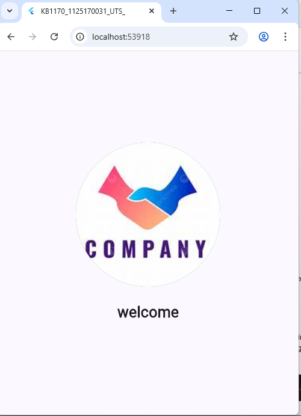

6. Menambahkan kata "Aplikasi dompet digital \n yang membuat anda mudah dalam transaksi" dengan menggunakan funsi \n
dimana berfugsi untuk membuat baris baru

7. Membuat 3 bulet kecil dibawah tulisan aplikasi dompet digital ...
    sebagai pemanis tampilan dengan menggunakan fungsi row

8. Membuat ElevatedButton pada text welcome

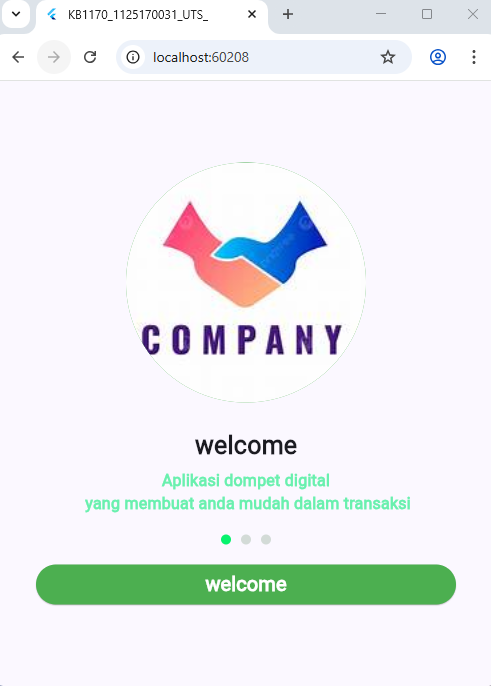

9. Membuat file splash_screen2 dan 3 serta mengubah sedikit isi dari splash_screen

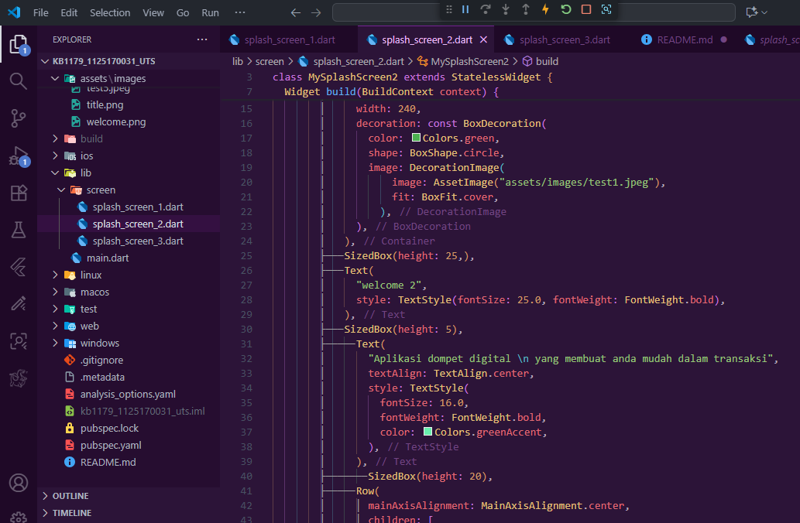

10. Membuat fungsi Navigator agar bisa pindah dari splash_screen_1 ke halaman splash_sampai splash_screen_3

**Berikut tampilan splash_screen1**

ketika tombol welcome1 ditekan makan akan mengarah ke tampilan splash_screen 2

ketika tombol welcome2 ditekan makan akan mengarah ke tampilan splash_screen 3

begitupun seterusnya selama fungsi dari onPressed di buat

11. membuat login.dart dengan tahapan awal pembuatan logo atau image terlebih dahulu

12. menambahkan Text “Welcome” dan “Silakan login untuk     melanjutkan

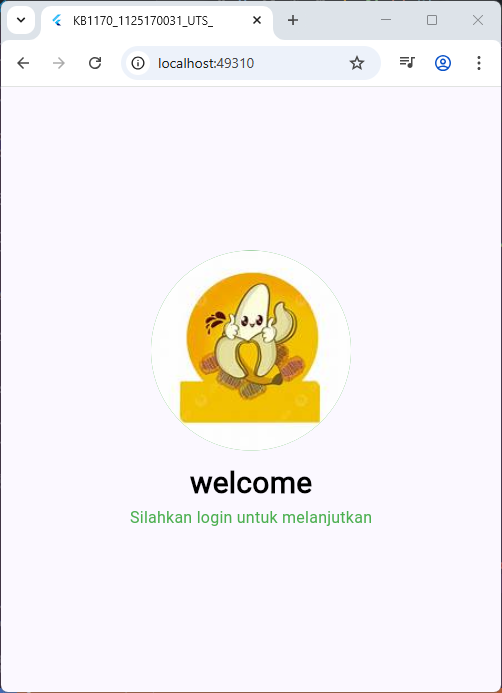

13. membuat decoration untuk email

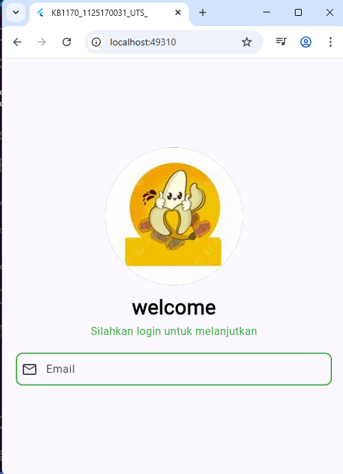

14. membuat decoration d Input Password

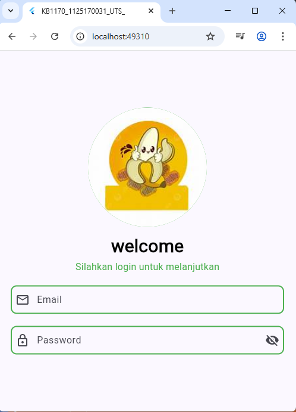

15. menambahkan text lupa password

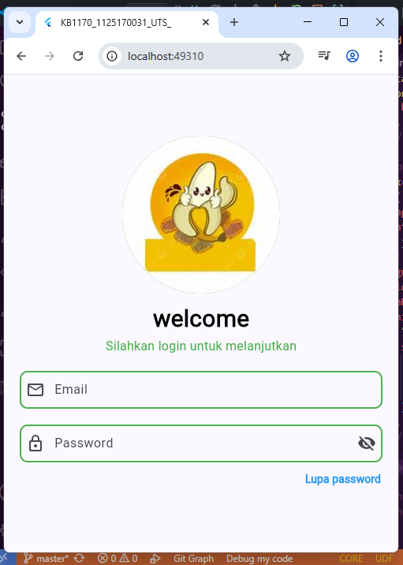

16. membuat button

17. membuat garis

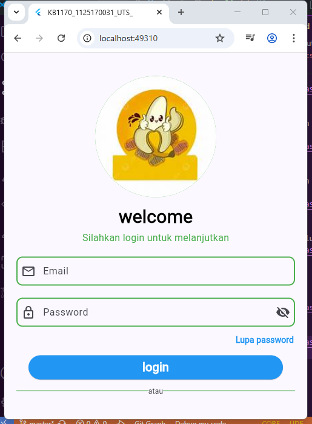

18. membuat sosial button

19. Membuat Navigator.pushAndRemoveUntil menghapus semua halaman sebelumnya.

**done**