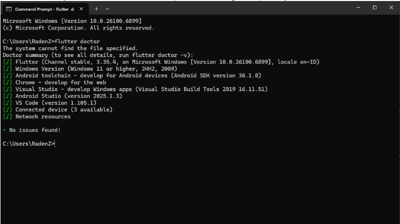
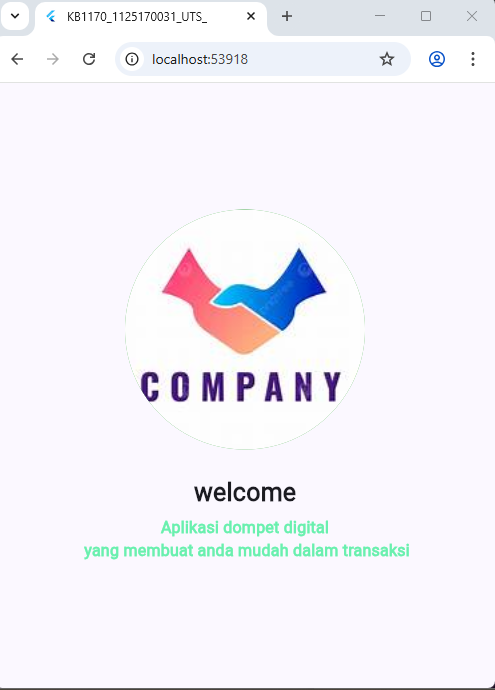
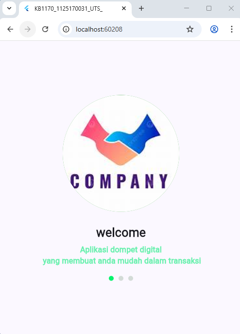
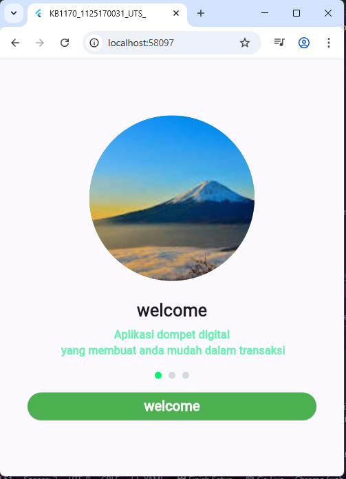
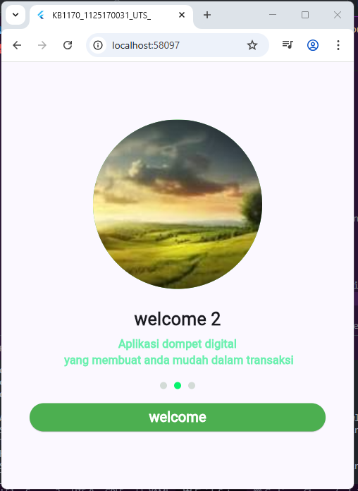
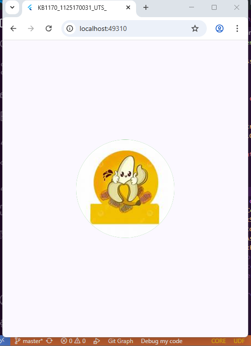
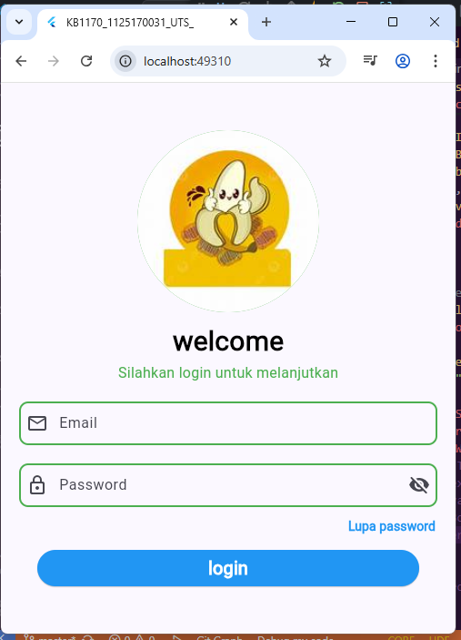
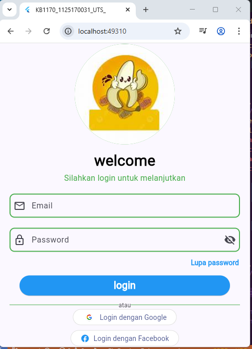

# kb1179_1125170031_uts

**Ujian Tengah Semester Flutter — UI + Deploy + Git**

## Getting Started
---

## 👤 Identitas
- **Nama Lengkap:** Jejen Jaenudin  
- **NIM:** 1125170031  

---

## 🚀 Cara Menjalankan Project

### 🧩 1️⃣ Persiapan
Pastikan sudah menginstall:
- [Flutter SDK](https://docs.flutter.dev/get-started/install)
- Android Studio / VS Code
- Emulator Android ATAU aktifkan mode *Developer* dan *USB Debugging* di HP kamu
- Atau jika komputerkamu spesifikasinya kurang baik, jalankan di google chrome saja

---

### 💻 2️⃣.1️⃣ Jalankan di **VS Code**

1. **Lakukan Git Clone** pada repository berikut:
   ```bash
   git clone https://github.com/jejenjaenudin0895/KB1179-1125170031-uts.git

2. Sebelum buka foldernya cek terlebih dahulu di terminal dan pastikan sudah menginstal dependency:
    
3. Buka Hasil Clone dari Repo yang sudah di ambil sebelumnya dengan Visual Studio Code / Android Studio
4. Di Terminal lakukan perintah seperti berikut ini :
    - flutter pub get
    - flutter run

### 2️⃣.2️⃣ Jalankan Perintah di Terminal dengan Android Studio
* Lakukan hal yang sama pada sebelumnya
- A. Jalankan lewat Android Studio
    Buka Android Studio → tab Device Manager
    Buat atau jalankan Android Virtual Device (AVD)
    Setelah emulator aktif, buka project di Android Studio atau VS Code
- B. Jalankan perintah: 
    flutter run -d emulator-5554 
    *(ganti emulator-5554 sesuai nama emulator dari hasil flutter devices)

### 3️⃣ Cek Devices yang Tersambung
flutter devices

### 4️⃣ Jalankan Aplikasi
flutter run

### ⚙️ 5️⃣ Perintah Umum

| 🧩 **Tujuan** | 💻 **Perintah** |
|---------------|----------------|
| Mendapatkan dependency | `flutter pub get` |
| Menjalankan project | `flutter run` |
| Menjalankan di device tertentu | `flutter run -d <device_id>` |
| Melihat daftar device | `flutter devices` |
| Membersihkan build lama | `flutter clean` |

✨ **Kelebihan versi ini dan 📋 Penjelasan tambahan::**
- README ini sudah mendukung **semua mode (Windows Desktop, Chrome, dan Android)**.  
- Kamu cukup menyesuaikan nama file screenshot di bagian atas.  
- Simpan file ini sebagai `README.md` di root project.  
- Sudah lengkap semua mode (Windows, Chrome, Android)
- Ada badge otomatis yang tampil keren di GitHub
- Ada ikon per platform (🖥️ 🤖 🌐)
- Bagian *Catatan & Kendala* tampil menarik dan mudah dibaca  


**berikut tahapan-tahapan pembuatan project**

1. Membuat app bar di main.dart dengan title: "KB1170_1125170031_UTS_",


2. membuat splash_screen_1.dart dengan tampilan emage bulat dengan posisi berada di pojok kiri atas layar


3. Merubah posisi image di bagian tepat pada tengah layar


4. Menambahkan Logo (gambar) pada BoxDecoration


5. Menambkahan tulisan welcome dibawah gambar


6. Menambahkan kata "Aplikasi dompet digital \n yang membuat anda mudah dalam transaksi" dengan menggunakan funsi \n
dimana berfugsi untuk membuat baris baru



7. Membuat 3 bulet kecil dibawah tulisan aplikasi dompet digital ...
    sebagai pemanis tampilan dengan menggunakan fungsi row



8. Membuat ElevatedButton pada text welcome


9. Membuat file splash_screen2 dan 3 serta mengubah sedikit isi dari splash_screen


10. Membuat fungsi Navigator agar bisa pindah dari splash_screen_1 ke halaman splash_sampai splash_screen_3

**Berikut tampilan splash_screen1**



ketika tombol welcome1 ditekan makan akan mengarah ke tampilan splash_screen 2



ketika tombol welcome2 ditekan makan akan mengarah ke tampilan splash_screen 3


begitupun seterusnya selama fungsi dari onPressed di buat

11. membuat login.dart dengan tahapan awal pembuatan logo atau image terlebih dahulu



12. menambahkan Text “Welcome” dan “Silakan login untuk     melanjutkan


13. membuat decoration untuk email


14. membuat decoration d Input Password


15. menambahkan text lupa password


16. membuat button



17. membuat garis


18. membuat sosial button



19. Membuat Navigator.pushAndRemoveUntil menghapus semua halaman sebelumnya.

## 💖 Terima Kasih!

> Terima kasih sudah melihat project ini!  
> Semoga project ini bermanfaat dan bisa jadi inspirasi buat teman-teman yang sedang belajar Flutter 💫  

**done**